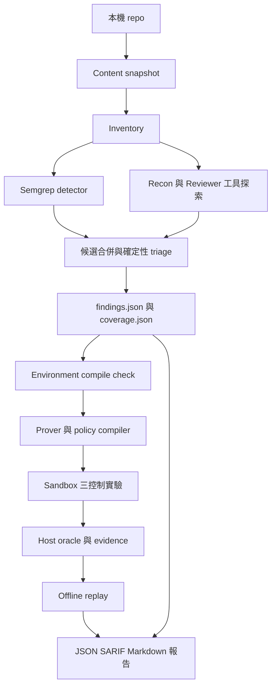
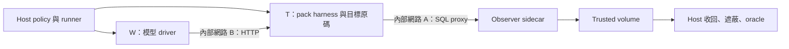

# Aegis 技術架構

本文描述目前 Go CLI 的實作，供閱讀原始碼、擴充 runtime／pack 與維護驗證流程使用。版本基準見 [文件索引](README.md)；命令與欄位細節見 [介面與資料契約](CONTRACTS.md)。

## 1. 系統定位與實作範圍

Aegis 是本機程式碼安全審查工具，入口為 `cmd/aegis`。它把候選發現交給確定性 detector 與 LLM，把漏洞成立與否交給 host 端的政策、控制實驗及 oracle。它沒有提供供外部客戶端使用的 REST API、常駐 Web server 或多租戶服務；整合介面是 CLI 與 run 目錄中的產物。

目前內建 `python-web` pack，提供 Python SQL 字串串接 detector、Python HTTP direct／witness template、SQL error oracle 與 SQL sink-touch oracle。Reviewer 可探索多種語言，但語言辨識、detector、runtime、oracle 是不同能力：辨識到 Go 檔案不表示已有 Go 的沙箱證明 backend。

`internal/agentenv` 另有 agent-authored environment 的實作與測試，但目前 `cmd/aegis` 未引用該套件。因此其 build recipe／nonce oracle 能力不應當作標準 `review` 或 `prove` 已開放的功能。

## 2. 模組分工

| 路徑 | 職責與主要邊界 |
| --- | --- |
| [cmd/aegis](../cmd/aegis) | Cobra 命令、五階段 review、run 選擇、設定與各模組接線 |
| [cmd/aegis/roles.go](../cmd/aegis/roles.go) | Recon、Reviewer、Triager、Reporter 呼叫及候選定位驗證 |
| [cmd/aegis/trace.go](../cmd/aegis/trace.go) | AI 事件檔與 watch 顯示 |
| [internal/console](../internal/console)、[internal/tui](../internal/tui) | 指令解析、互動設定、Bubble Tea 終端介面與語言偏好 |
| [internal/settings](../internal/settings)、[internal/credentials](../internal/credentials) | 模型路由、預算與憑證解析；金鑰不由 pack 管理 |
| [internal/inventory](../internal/inventory) | 檔案、語言、框架、依賴、路由與入口盤點 |
| [internal/candidates](../internal/candidates)、[internal/triage](../internal/triage) | Semgrep 候選合併、可達性、嚴重程度與信心值計算 |
| [internal/llm](../internal/llm)、[internal/agent](../internal/agent) | Provider adapter、工具迴圈、角色白名單、工具稽核 |
| [internal/orchestrator](../internal/orchestrator) | Prover 迴圈、三控制 run、結果分類、證據寫入與 replay |
| [internal/orchestrator/policy](../internal/orchestrator/policy) | 驗證 WitnessSpec，編譯可信 RunRequest |
| [internal/orchestrator/budget](../internal/orchestrator/budget) | 確定性的失敗分類、預算扣抵與停止條件 |
| [internal/orchestrator/snapshot](../internal/orchestrator/snapshot) | 內容定址快照、複製與完整性驗證 |
| [internal/sandbox](../internal/sandbox) | Docker CLI、hardening、staging、容器與 volume 生命週期、產物收回 |
| [internal/observerproxy](../internal/observerproxy) | SQLite observer 協定與可信 SQL trace；入口為 `cmd/aegis-observer-proxy` |
| [internal/oracles](../internal/oracles) | 純 Go artifact checker，規則只含資料，不執行模型程式 |
| [internal/evidence](../internal/evidence)、[internal/journal](../internal/journal) | Canonical JSON、hash chain、bundle manifest、SQLite 事件與 ID 分配 |
| [internal/packs](../internal/packs)、[internal/schemav](../internal/schemav) | Pack ABI、schema、內容雜湊、capability 與 paired touch 驗證 |
| [internal/approval](../internal/approval)、[internal/doctor](../internal/doctor) | 建置核准與環境檢查／修復 |
| [internal/redaction](../internal/redaction)、[internal/reporting](../internal/reporting) | Secret gate、遮蔽、JSON／SARIF／Markdown 報告 |
| [embedded.go](../embedded.go)、[packs/python-web](../packs/python-web) | 發布資產嵌入，以及 Python runtime、template、helper 與規則 |

流程編排仍有相當部分位於 `cmd/aegis/main.go`，不是所有業務邏輯都在 `internal/orchestrator`。新增功能時應先找到實際呼叫點，避免只擴充底層套件而未接入 CLI。

## 3. Review 資料流

此圖表示主要資料依賴；是否執行 environment、prove、replay 由能力與前一階段結果決定。

### 3.1 Scan：快照、盤點與候選

1. 依 `--target` 與可選的 `--target-subdir` 選定掃描根目錄。
2. `snapshot.Create` 複製原始碼，得到 `SN-<12 hex>` 與完整 `tree_hash`。
3. `inventory.Build` 盤點快照，載入並驗證 pack。
4. 執行 Semgrep detector；若 Reviewer 已設定，Semgrep 不存在或失敗可降級並記錄 coverage notes。未設定 Reviewer 時，detector 無法工作會回錯，避免把未掃描解讀成零弱點。
5. Reviewer 先按檔名批次進行唯讀工具探索，再做全域候選綜整。候選的 `file:line` 必須能在快照中核對；這只保證定位有效，不能取代漏洞證明。
6. 合併候選，由 `triage.EvaluateAt` 計算可達性。LLM Triager 的輸出追加為 rationale，不直接改寫確定性可達性分類。
7. 分配 finding ID，寫入 `inventory.json`、`coverage.json`、`candidates.json`、`triage.json`、`findings.json` 與 journal。

初始 finding 為 `verification=NOT_RUN`、`disposition=OPEN`。`proof_supported` 由 sink family 能否配對 pack template／oracle 決定；不支援機械驗證的候選仍保留。

### 3.2 快照一致性

快照以相對路徑及內容 SHA-256 建立 tree hash；symlink 以 link target 字串作為內容，不跟隨複製，偵測到指向根目錄外會拒絕。`.git` 一律排除，CLI 另傳入 inventory 的預設排除集合，如 `.env`、虛擬環境、`node_modules`、`dist`、`build`、`out`。

建立過程先計算 hash 以判斷能否重用；需要複製時再對實際複製的內容重算 hash，暫存目錄完成後 rename。重用既有快照前會驗證內容；prove 掛載前也會對 journal 記錄核對。這避免掃描後原 repo 改動影響同一 run，但不是檔案系統層的不可變儲存。

快照排除與傳給 Reviewer 的檔案篩選分別在 snapshot、inventory 與 `roles.go` 實作，並非自動完整套用 `.gitignore`。自訂 `--run-dir` 宜放在目標外或已排除的 `out/`，避免後續掃描把舊產物納入。

### 3.3 Environment：驗證 runtime 準備程度

`prepareRunEnvironment` 解析固定映像，必要時走建置核准，再以唯讀快照與 `--network none` 執行 Python `compile()` smoke check，host timeout 為 120 秒。結果記入 `environment.json`。

`SOURCE_COMPILED` 只代表語法／編譯檢查成功，不會證明第三方依賴已安裝、服務已啟動或漏洞可利用。環境準備失敗時，`review` 會保留錯誤並嘗試產生報告，最後以非零退出碼回報不完整流程。

### 3.4 Prove：模型提案，程式決定執行

手動模式從 `--spec` 讀 WitnessSpec；自動模式由 Prover tool loop 提交。兩者都經 schema 與 policy gate，不能直接提交 Docker command 或 RunRequest。

Policy 依序核對 template／oracle 家族與模式、快照中的 target symbol、生成檔案的路徑與大小、payload nonce placeholder、秘密樣式、D2／D3 的 assumptions，以及重複 spec hash。Observer-backed 模式額外把宣告式 wiring 編成 `target/binding.json`。

每個控制 run 由 host 產生 16-byte 隨機 nonce（32 個十六進位字元）。Policy 替換 payload／generated files 的 placeholder，選定映像、命令、timeout、網路與 service 接線，產生 RunRequest。Orchestrator 只將它翻譯為 `sandbox.RunSpec` 並執行。

固定控制順序為：

| Run | 檢查目的 | 繼續條件 |
| --- | --- | --- |
| `negative` | 良性控制不應觸發漏洞判定 | Run 正常且 vulnerability oracle 為 false |
| `positive` | 輸入確實抵達受測 sink | Run 正常且 paired touch oracle 為 true |
| `exploit` | 攻擊 payload 是否造成對應副作用 | Exit 0 且 vulnerability oracle 為 true 才能 `PROVEN` |

Positive 失敗就不執行該迭代的 exploit。Exit 0 只表示程式跑完，模型 stdout 的成功訊息不參與 oracle 判定。修正、假設與時間用量交由 budget 模組收斂，詳見 [失敗分類](CONTRACTS.md#4-失敗分類與停止條件)。

### 3.5 Replay 與 report

`ReplayBundle` 先驗證 evidence chain 與 bundle manifest，再核對各 run 的 artifact byte hash、canonical RunRequest hash，使用保存的 nonce 重算 vulnerability／touch oracle，與原 evidence 結果比較。

Replay 不呼叫 LLM、不啟動容器、不重新觸發漏洞。它需要完整 bundle 及相容 pack／checker，驗證的是「保存的證據與規則判定一致」。Bundle 中的 hash 不是數位簽章，不能防止有權改寫整份 bundle 與 manifest 的人重新計算所有 hash；跨系統保存仍須管理來源與存取權限。

Report 依 findings 輸出 JSON、SARIF 與 Markdown。未設定 Reporter 時使用確定性模板；設定後會把 findings、coverage、environment 交給 Reporter 撰寫 Markdown。機器整合應讀結構化欄位，不依賴 Markdown 中模型使用的措辭。

## 4. LLM 與工具邊界

[llm.Adapter](../internal/llm/llm.go) 以 `Chat(context.Context, ChatRequest) (Response, error)` 與 `Provider() string` 統一供應商。訊息包含 text、tool_use、tool_result，回應保留 stop reason 與 token usage。現有 adapter 為 Anthropic 與 OpenAI-compatible；模型引用的第一個 `/` 分隔 provider 與模型 ID。

Reviewer 使用 `read_code`、`search_code`、`semgrep`；Prover 加上 `submit_witness_spec`。工具定義讀取 schemas，執行時仍檢查角色白名單。預設 agent session 上限為 32 回合；單次讀取最多 200 KiB，搜尋最多 50 筆、單行最多 200 bytes，工具版 Semgrep 結果最多 200 筆。

工具稽核必須可寫：沒有 audit log 或無法持久化 allow 決策就拒絕工具呼叫。`read_code` 的路徑受快照範圍檢查；模型不能透過這些工具執行任意 host shell。每個 session 只接受一份 WitnessSpec，後續嘗試須由外層迴圈管理。

`--watch` 呈現階段、公開 commentary、工具參數與摘要。`ai-events.jsonl` 保存更完整的事件，`audit.jsonl` 保存工具與 gate 決策，兩者以 `0600` 寫入。這些輸出不是模型隱藏推理；事件檔可能包含程式碼與請求內容，仍需按專案敏感資料管理。

## 5. Observer-backed 沙箱信任邊界

這裡的雙容器指 target T 與 driver W，另外還有 observer sidecar。T 接入兩個網路；W 只接入 driver network，沒有 observer network 的直接路徑。模型生成的 exploit 在 W 執行；T 只執行 pack harness 與快照原碼。T 雖在較可信的一側，受測 repo 本身仍可能是惡意程式。

| 資源 | T：target | W：driver |
| --- | --- | --- |
| `/target` | 快照唯讀掛載 | 不掛載 |
| Witness volume | 唯讀，讀取 policy 生成的 binding | 唯讀，執行 `witness/*` |
| Payload 固定掛載 | Split 模式不掛載 | `/aegis/payload.txt` 唯讀 |
| `/aegis/out` | Named volume，可收回 target 產物 | Tmpfs，模型寫入不作為收回 artifact |
| Observer network | 可連線 | 不加入 |
| Driver network | Alias `target` | 以 HTTP 呼叫 target |

實作使用同一個 staged witness volume，因此不能把「T 不執行模型程式」描述成「T 完全看不到模型檔案」。主要防線是程序執行路徑、網路與可信 artifact 寫入者的切分。

共用 hardening 包含 UID/GID `65532:65532`、`--cap-drop ALL`、`no-new-privileges`、pack seccomp、唯讀 rootfs、限定 tmpfs、128 PIDs、512 MiB 記憶體、1 CPU、nofile 256；policy 的單次 proof timeout 為 60 秒。映像必須以 `name@sha256:<64 hex>` 定址，缺 seccomp 不會改用較寬鬆模式。

Runner 透過 `os/exec` 呼叫 Docker CLI。Staging 使用 named volume，生命週期結束後收回指定產物並清理容器、network 與 volume；不把 host 目錄以可寫方式交給 proof container。強制終止 host 程序仍可能留下資源，排查方式見 [維運文件](DEVELOPMENT.md)。

SQL oracle 從 observer 的 `sql_trace.jsonl` 判讀：`sink.touch.sql/v1` 檢查 `sql` 含 nonce，`sqli.error/v1` 檢查含 nonce 的 SQL 同時存在非 null error。Checker 另有其他 condition kind，但沒有配套 runtime、observer 和 pack 時，不代表相關漏洞家族已可端到端證明。

## 6. Secret gate 與殘餘限制

Provider key 由 host adapter 使用，不注入沙箱。送入模型、提交 spec 與寫入產物有秘密樣式檢查，但這是固定樣式偵測，不能保證辨識所有秘密，也可能誤判 nonce 或一般文字。

不同落盤面的處理不同：

| 內容 | 命中秘密樣式時 |
| --- | --- |
| WitnessSpec | Policy 拒收 |
| 一般報告／findings 等經 `redaction.WriteFile` 的內容 | 拒絕寫入 |
| Proof stdout／stderr | Run 拒收 |
| Trusted artifact | 以 `***REDACTED***` 遮蔽匹配段後落盤，記錄 `artifact_redactions` |
| Target 資訊性 log | 命中時不落檔，不因此中斷該 run |

Artifact hash 以遮蔽後 bytes 計算，replay 使用相同內容。若遮蔽移除了 oracle 所需 nonce，證據便無法成立，不能繞過遮蔽補判成功。決策背景見 [ADR 0006](adr/0006-trusted-artifact-redaction.md)。

目前 wiring setup 禁止 nonce placeholder，包括巢狀陣列中的值，以免 setup 先產生 positive touch。這比 [ADR 0005](adr/0005-split-container-trust-boundary.md) 初版允許 placeholder 的描述更嚴格，以目前 schema 與 `policy.buildBinding` 為準。

D2／D3 的 witness 證明依賴合成接線與 assumptions，不代表原應用預設路徑可達。惡意 target 原碼在 T 中可接觸 observer，並不在「抵禦模型 driver 偽造」這條邊界所完整涵蓋的範圍內；本機 Docker／host 管理者與 bundle 儲存來源也屬信任前提。更多背景見 [威脅模型](threat-model.md)。
